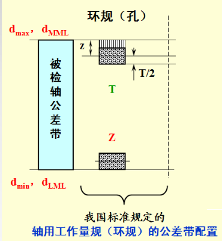
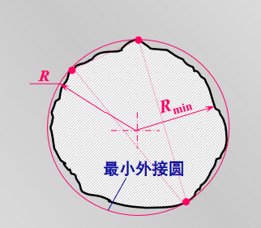
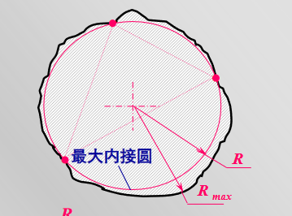
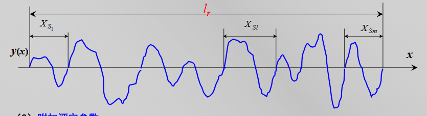
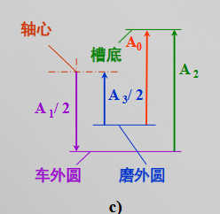

# 互换性笔记

## 互换性定义：

<a href="zotero://open-pdf/library/items/3MHKYYAR?page=2">“按规定的几何、物理及其他质量参数的极限，来分别制造机械的各个组成部分，使其在装配与更换时不需辅助加工及修配，便能很好地满足生产和使用上的要求。”</a>

## 互换性的分类：

### 1.按决定参数分类：

<a href="zotero://open-pdf/library/items/3MHKYYAR?page=3">“功能互换性”</a>（广义互换性）

<a href="zotero://open-pdf/library/items/3MHKYYAR?page=3">“几何参数互换性”</a>（狭义互换性）

### 2.按互换性的方法及程度分类：

#### 完全互换

#### 不完全互换性：

##### 概率互换

##### 分组互换

##### 调整互换与修配互换

### 3.按互换的部位或范围分类

#### 外互换

<a href="zotero://open-pdf/library/items/3MHKYYAR?page=5">“与其相配件之间的互换”</a>

#### 内互换

<a href="zotero://open-pdf/library/items/3MHKYYAR?page=5">“其内部组成零件之间的互换”</a>

## 优先数系：

### 细分原则：

<a href="zotero://open-pdf/library/items/3MHKYYAR?page=12">“每个10进段( y0～yr )细分为 r 个小段，使细分段的数 值成公比为 qr 的等比数列，且每间隔 x 项数值加倍。”</a>

$\frac{y_r}{y_0}=10=q_r^r\quad\frac{y_x}{y_0}=2=q_r^x$

$\frac{x}{r}=log_{10}2\approx0.301\approx\frac{3}{10}$

<a href="zotero://open-pdf/library/items/3MHKYYAR?page=14">“优先数系中，每个十进段分别可分为 5，10，20，40，80个（r 个）细分段， 对应这不同的细分段，每间隔 3、6、12、24（除R 5系列）项，数值分别扩大 2 倍；”</a>

## 测量：

<a href="zotero://open-pdf/library/items/BHIZIYTP?page=3">“被测量Q 与单位量μ（或标准量）进行比较，确定二者比值 x 的 实验过程。”</a>

### 测量结果：

$Q=x\cdot\mu$

### 测量方法：

$\{\begin{array}{lr}\text{广义：指测量时采用的原理，器具，条件的总和}\\\text{一般：实际工作中往往从获得测量结果的方式来理解测量方法}\end{array}$

### <a href="zotero://open-pdf/library/items/BHIZIYTP?page=8">“测量方法的分类”</a>

### <a href="zotero://open-pdf/library/items/BHIZIYTP?page=9">“测量器具与测量方法的基本度量指标”</a>

#### <a href="zotero://open-pdf/library/items/BHIZIYTP?page=9">“(1) 刻度间距 C: Scale Division (Spacing)”</a>

#### <a href="zotero://open-pdf/library/items/BHIZIYTP?page=9">“(2) 分度值（刻度值）i ： Value of a Scale Division 1 0 0.001 千分表 每个 C 所代表的量值”</a>

#### <a href="zotero://open-pdf/library/items/BHIZIYTP?page=10">“(3) 灵敏度与放大比：Sensitivity and Magnification”</a>

##### 灵敏度：

<a href="zotero://open-pdf/library/items/BHIZIYTP?page=10">“示数装置的被观察变量的增量△L与相应的被测量的增量△x 之比。”</a>

$\text{绝对灵敏度}-s=\frac{\Delta{L}}{\Delta{x}}\quad\quad\text{相对灵敏度}-S_0=\frac{S}{x}$

##### 放大比：

<a href="zotero://open-pdf/library/items/BHIZIYTP?page=10">“当△L与△x为同一类量时，灵敏度亦称为放大比 K”</a>

$K=\frac{\Delta{L}}{\Delta{x}}=\frac{刻度间距}{分度值}=\frac{C}{i}$

#### <a href="zotero://open-pdf/library/items/BHIZIYTP?page=10">“灵敏限（迟钝度）”</a>

$\{\begin{array}{lr}\text{引起示值变化的被测量的最小变动量；}\\\text{不引起示值变化的被测量的最大变动量；}\end{array}$

#### <a href="zotero://open-pdf/library/items/BHIZIYTP?page=11">“(5) 示值误差：Error of Indication”</a>

示值误差=示值-真值

#### <a href="zotero://open-pdf/library/items/BHIZIYTP?page=11">“(6) 校正值（修正值）”</a>

### 测量误差：

#### 测量误差源：

##### <a href="zotero://open-pdf/library/items/BHIZIYTP?page=16">“阿贝原则”</a>

##### <a href="zotero://open-pdf/library/items/BHIZIYTP?page=17">“最短测量链原则”</a>

<a href="zotero://open-pdf/library/items/BHIZIYTP?page=17">“量块置于测量链中时，应该以最少的量块数组成所需 组合尺寸（量块数越多累积误差越大）”</a>

##### <a href="zotero://open-pdf/library/items/BHIZIYTP?page=17">“基准统一原则”</a>

被测件的安装和定位应当合理

##### <a href="zotero://open-pdf/library/items/BHIZIYTP?page=18">“最小变形原则”</a>

#### 系统误差：

##### 定值系统误差：

对每次测得的值的影响是相同的，误差的绝对值和符号保持恒定

##### 变值系统误差：

对每次测量值的影响是按一定规律变化的

##### 残余误差核算法：

$\sum_{i=1}^{n/2}v_i与\sum_{i=1+\frac{n}{2}}^{n/2}v_iz之差相对于v_i接近与0$

#### 随机误差：

$样本均值：\overline{x}=\frac1n\sum_1^nx_i\rightarrow\mu(总体数学期望)\\样本标准差：S=\sqrt{\frac{\sum(x_i-\overline{x})^2}{n-1}}\rightarrow\sigma(总体均方差)\\均值的标准差：\sigma_{\overline{x}}=\frac{S}{\sqrt{n}}\rightarrow\frac{\sigma}{\sqrt{n}}(总体数学期望的均方值)\\样本均值的极限误差：\Delta_{\overline{x}lim}=\pm3\sigma_{\overline{x}}\\测量结果的表达：x=\overline{x}\pm3\sigma_{\overline{x}}=\overline{x}\pm\Delta_{\overline{x}lim}$

#### 粗大误差：

3$\sigma$原则：

粗大误差的界限为：$|v_i|>3\sigma$(但是当n$\leq$10,无法无法提出任何粗大误差)

狄克逊原则：

计算可疑比：$\mathcal{f}=\frac{x_n-x_{n-1}}{x_n-x_1}或\mathcal{f}=\frac{x_2-x_1}{x_n-x_1}$

## 圆柱结合：

### 基本概念

#### 间隙配合：

$X_{max}=ES-ei\geq0;\\X_{min}=EI-es\geq0;\\X_{av}=\frac{X_{max}+X{min}}{2}>0$

#### 过盈配合：

$Y_{max}=EI-es<0;\\Y_{min}=ES-ei\leq0;\\Y_{av}=\frac{Y_{max}+Y{min}}{2}<0$

#### 过度配合：

$X_{max}=ES-ei>0;\\Y_{max}=EI-es<0$

#### 配合公差：

$T_f=T_H+T_S$

### 公差大小：

$T=a\cdot i$

$当D\leq mm时,\quad i=0.45\sqrt[3]{D}+0.001D\\当D>500mm时,\quad I=0.004D+2.1$

$D_m=\sqrt{D_1D_2}$

### 基本偏差：

基本偏差计算的例外情况：$ES=-ei+\Delta,\Delta=IT_n-IT_{n-1}$

两配合等效$\Leftrightarrow$极限过盈/间隙相等

### 量规：

#### 泰勒原则：

$\{\begin{array}{lr}通规做成全形D_a\geq D_{M}\geq D_{MML}\\\\止规做成不完全形，多点测试D_a\leq D_{LML}\end{array}$

##### 一般性的泰勒原则：

孔、轴的作用尺寸不运行超出(材料占用量)最大实体极限

任何位置上的实际尺寸不允许超出最小实体尺寸

## 几何公差：

### 直线度误差的测量:

打表法：中等尺寸、精度不高，数据直接测量得到，无需累加。

自准仪：中等以上尺寸、较高精度，数据为后点对前点的高度差。

### 直线度误差的评定：

1.<a href="zotero://open-pdf/library/items/9DEUXU42?page=6">“首尾连线法 — (1)”</a>

2.<a href="zotero://open-pdf/library/items/9DEUXU42?page=6">“最小二乘法 — (2)”</a>

3.<a href="zotero://open-pdf/library/items/9DEUXU42?page=6">“最小区域法 — (3)”</a>

### 平面度误差评定：

最小区域法：$min[max|Z_i-(ax_i+by_i+c|+max|z_i+(ax_i+by_i+c)|]$

#### 三角准则：

一个面上接触的等高最高（或最低）点所形成的三角形中包围着与另一个面接触的最低（或最高）点，此即三角形准则。

#### 交叉准则：

和一个面接触的两等高最高（或最低）点连线，与和另一平面接触的两等高最低（或最高）点连线交叉。

#### 直线准则：

和一个面接触的最低（或最高）点，在和一个面接触的两等高最高（或最低）点连线上。

### 圆度误差：

#### 两点法：

$\text{其圆度误差为：}f_0=\frac{a-b}{2}\quad长轴a、短轴b$

#### 最小二乘圆法:

$f_0=R_{max}-R_{min}$

#### 最小外接圆：

$f_0=R-R_{min}$

<a href="zotero://open-pdf/library/items/9DEUXU42?page=20">“外接圆心位于三接触点构成的三角形区域之内， 则为最小外接圆。”</a>

#### 最大外接圆：

$f_0=R_{max}-R$

<a href="zotero://open-pdf/library/items/9DEUXU42?page=21">“内接圆心位于三接触点构成的三角形区域之内， 则为最小内接圆。”</a>

#### 最小区域法：

$f_0=R_{max}-R_{min}$

### 平行度：

#### <a href="zotero://open-pdf/library/items/9EZMYAH8?page=6">“(1) “打表”法”</a>

$\mathcal{f}_{//}=\frac{l|M_a-M_b|}{L}$

### 同轴度：

$\mathcal{f}_j=\max\limits_{i=1,2,...,n}|M_{j,ai}-M_{j,bi}|\quad\mathcal{f}=\max\limits_{j=1,2,..,m}(\mathcal{f}_j)$

### 公差原则：

#### <a href="zotero://open-pdf/library/items/LMYQA96Y?page=4">“独立原则”</a>：

形位公差和尺寸公差相互独立

#### 相关原则：

##### 最大实体要求：

$孔：\{\begin{array}{lr}D_M\geq D_{vc}=D_{MMC}-t_g=D_{min}-t_g\\D_{max}\geq D_a\geq D_{min}\end{array}$

$轴：\{\begin{array}{lr}d_M\leq d_{vc}=d_{MMC}+t_g=d_{max}+t_g\\d_{max}\geq d_a\geq d_{min}\end{array}$

##### 包容要求（ER）：

$孔：\{\begin{array}{lr}D_M\geq D_{MMC}=D_{min}\\D_{max}(D_{LMC}\geq D_a\geq D_{min}(D_{MMC})\end{array}$

$轴：\{\begin{array}{lr}d_M\leq d_{MMC}=d_{max}\\d_{max}(d_{MMC}\geq d_a\geq d_{min}(d_{LMC}\end{array}$

\[<https://www.bilibili.com/video/BV1Dv4y147Ma/?spm_id_from=333.788.recommend_more_video.0&vd_source=95d6e5186f08a04bc6fb2bb15ef05420>]

## 粗糙度：

### 表面粗糙度对零件性能的影响

#### 对配合性质的影响

*   间隙配合：初期磨合使轮廓尖峰迅速磨损，实际间隙X

    $\uparrow$

*   过盈配合：装配后，轮廓尖峰被挤平（塑性变形），则有效过盈量

    $\downarrow$

    ，连接强度

    $\downarrow$

### 表面粗糙度的评定:

#### 取样长度:

<a href="zotero://open-pdf/library/items/8QHZSXAG?page=8">“用以判别和评定具有表面粗糙度特征的一段基准线长度”</a>

#### 评定长度:

<a href="zotero://open-pdf/library/items/8QHZSXAG?page=9">“客观全面地反映表面质量。加工表面的均匀程度不同，若按同一取样长度 依次测量几段轮廓，可得到不同的粗糙度值。”</a>

#### 轮廓中线：

*   轮廓最小二乘中线
*   轮廓的算术平均中线

#### 表面粗糙度评定参数：

##### 轮廓算术平均偏差Ra：

$R_a = \frac{1}{l} \int_0^l y(x) dx \quad \text{和} \quad R_a \approx \frac{1}{n} \sum_{i=1}^n |y_i|$

##### 轮廓最大高度Rz：

<a href="zotero://open-pdf/library/items/8QHZSXAG?page=13">“取样长度内轮廓峰顶线与轮廓谷底线之间的距离”</a>

##### 轮廓单元的平均宽度Rsm：

$\R_{sm}=\frac{\sum\limits_{i=1}^mX_{s_i}}{m}$   m-在取样长度内轮廓单元的个数

##### 轮廓支承长度率Emr(c)

$Ml(c)=Ml_1+Ml_2+…+Ml_n$

$Rmr(c)=\frac{Ml(c)}{lr}$

## 尺寸链基础：

### 环：

#### 封闭环：

$A_0$ 

<a href="zotero://open-pdf/library/items/TDRQX673?page=5">“尺寸链的形成过程中最后形成（或自然获得）的尺寸。”</a>

#### 组成环：

尺寸链中除封闭环以外的所有环

*   增环：在其他组成环尺寸不变时，封闭环与之成“正变”的组成环
*   减环：在其他组成环尺寸不变时，封闭环与之成“反变”的组成环

#### 计算公式:

基本公式：

$A_0=\sum\limits_{i=1}^mA_{i(+)}-\sum\limits_{i=m+1}^nA_{i(-)}\quad\quad\text{n:组成环个数，m：增环个数}$

极限尺寸：

$A_{0max}=\sum\limits_{i=1}^mA_{i(+)max}-\sum\limits_{i=m+1}^nA_{i(-)min}$

$A_{0min}=\sum\limits_{i=1}^mA_{i(+)min}-\sum\limits_{i=m+1}^nA_{i(-)max}$

极限偏差：

$ES_{0}=\sum\limits_{i=1}^mES_{i(+)}-\sum\limits_{i=m+1}^nEI_{i(-)}=A_{0max}-A_0$

$EI_{0}=\sum\limits_{i=1}^mEI_{i(+)}-\sum\limits_{i=m+1}^nES_{i(-)}=A_{0min}-A_0$

公差：

$T_0=\sum\limits_{i=1}^nT_i=A_{0max}-A_{0min}=ES_0-EI_0$

#### 最短尺寸链：

<a href="zotero://open-pdf/library/items/TDRQX673?page=11">“当 T0 一定时，若 n 增加，则各组成环的公差减小，工艺难度加大。 应当尽量减少尺寸链的环数（n↓）。”</a>

## 齿轮传动
